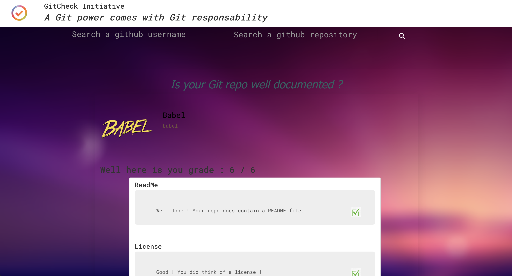

# TWEB - Projet 1 - GitCheck initiative

*Auteurs : Walid Koubaa, Romain Gallay*

***

## GitCheck initiative, c'est quoi ?

GitCheck est une application WEB permettant de visualiser la qualité d'un repo Github. Pour cela nous analysons la présence ou non de divers fichiers et dossiers qu'un bon projet devrait contenir, selon notre propre apréciation ainsi que celle de [Open Source Guides](https://opensource.guide/starting-a-project/#your-pre-launch-checklist). Cela comprend notamment la présence ou non d'un fichier README, d'un linter ou encore d'un répertoire de test.

Le projet est constitué d'une partie [client](https://github.com/zedsdead95/GitCheck-Initiative) et d'une partie [serveur](https://github.com/zedsdead95/GitCheck-express-server). Le client contient une page web dynamique qui lance des requêtes au serveur selon les informations entrées par l'utilisateur. Le serveur utilise la Github API pour récupérer sur Github les données demandées, les traite et envoie une réponse au client. Ce dernier peut finalement consulter les résultats de sa demande sur une interface attractive et conviviale. Il verra notamment quelles fichiers sont présents et dans le cas ou certains seraient absents, pourquoi ils sont importants.

## Déploiement

Afin de rendre notre application web accessible par n'importe qui sans necessairement devoir l'installer en local, nous avons déployé notre application avec Heroku. Grâce a Heroku, vous pouvez aisément chercher les repositories d'utilisateur GitHub et recevoir un feedback de la qualité de ce repo.

## Installation

Afin d'installer en local le projet il vous suffit de telecharger la partie client [client](https://github.com/zedsdead95/GitCheck-Initiative) puis la partie [serveur](https://github.com/zedsdead95/GitCheck-express-server).

Sur le fichier env.default dans le dossier **src** du serveur il faudra ajouter le token GitHub afin d'effectuer des requetes sur le Github API.

Ensuite il vous suffit d'ouvrir un Terminal et d'entrer la commande	

	npm start

aussi bien dans le dossier contenant la partie client que dans le dossier contenant la partie serveur.

## Utilisation

Si vous avez installé le projet en local et que le serveur est actif,il vous suffit d'entrer localhost:8080 (ou le port que vous avez défini précédemment) pour accéder au site web.

Autrement, le projet est host sur Heroku et accessible avec l'url suivante : [GitCheck](https://heroku...)

## Aperçu de l'application

Voic un aperçu visuel de l'application:

## Bonus

### Serveur

Nous avons décidé d'utiliser un serveur express qui fera l'intermédiaire entre le client (frontend) et la Github API, ceci principalement pour deux raisons :

1) Un client anonyme sera limité à 50 requêtes par heure sur la Github API. Notre serveur intègre un token d'authentification délivré par Github qui nous permet de traiter 5'000 requêtes par heure. Ceci permet donc à un client de dépasser la limite de 50 requêtes sans avoir besoin de s'identifier et sans que nous lui fournissions un token à notre nom ce qui serait une mauvaise pratique de sécurité.  
2) Même si le travail du serveur reste assez simple, il permet d'alléger la charge de travail du client et donc d'économiser ses ressources. Ainsi un client utilisant une machine peu puissante appréciera d'autant plus la légèreté de l'application GitCheck !

### Database

Comme expliqué dans le point précédent, nous avons décidé de mettre en place un serveur notamment pour permettre à un client anonyme de ne pas être bloqué après 50 requêtes. Mais que se passe-t-il si une centaine de clients effectuent chacun 50 requêtes durant l'heure courante ? Ils se retrouveront bloqués, tout comme les utilisateurs suivants. Pour éviter ceci, nous avons mis en place une database MongoDB contenant le résultat des requêtes précédemment envoyées par nos clients. Ainsi lorsqu'un client demandera une information déjà contenue dans la base de données, le serveur le détectera et à la place d'envoyer une nouvelle requête à la Github API, il ira simplement chercher la réponse dans la database pour l'envoyer au client.

### Sticky application

Qui n'a jamais eu envie de savoir si des grands ou petits projets respectaient vraiment les bonnes pratiques open source ? Quel développeur ne s'est jamais demandé si son projet avait l'air suffisemment sérieux aux yeux des utilisateurs externes ? Et cela sera-t-il suffisant pour encourager la communauté à y participer, ou manque-t-il des éléments importants qui pourraient non seulement ajouter un aura de dignité au projet mais également montrer des éléments utiles pour le déploiement, l'usage ou encore l'amélioration dudit projet ? Pour le découvrir, n'attendez plus ! Gitcheck initiative est là pour répondre à vos questions et pour vous guider sur le chemin des bonnes pratiques open source.

### UI/UX Effort

1) Well designed application:

Notre application est non seulement utile pour tout membre de la grande communauté qu'est GitHub, la rendant pratique pour estimer la qualité d'un repository mais aussi esthétiquement très agreable avec un background agréable.

2) Agreable user experience:

Le design du site est épuré et le nom du projet "GitCheck" est en parfait accord avec son objectif (checker la qualité d'un repo GitHub) et très évocatif. De plus le slogan choisi est *catchy*, renforcant l'ancrage dans le subconscient des utilisateurs de notre application web.

