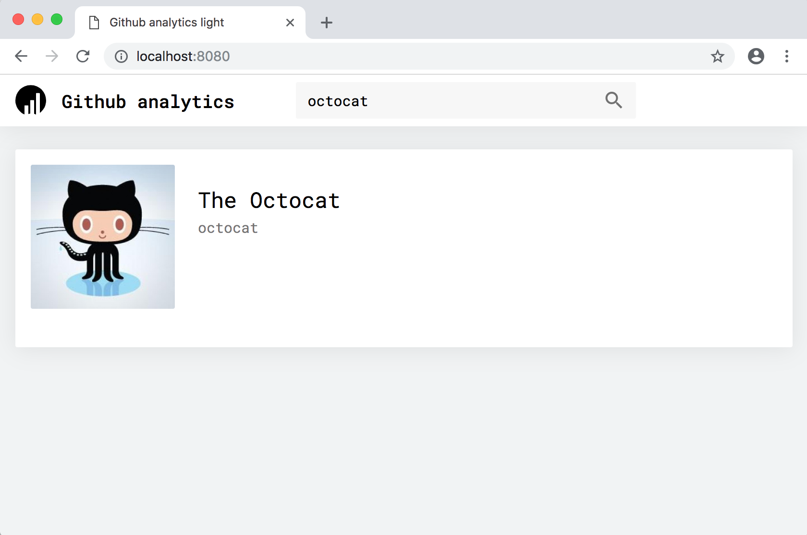

# Github analytics light 

A minimal starter project to practice with [Github REST API](https://developer.github.com/v3/). 



## Running the app

1. Install project dependencies
```sh
$ npm install
```

2. Run the app

Run the following command to start a development server.
```sh
$ npm start
```

## Try implementing features

- Use the [Fetch](https://developer.mozilla.org/en-US/docs/Web/API/Fetch_API/Using_Fetch) API to request data from github. 
- Load users profile informations and display them in a profile widget.
- Load and display users favorite languages based on their public repositories in a Chart. 
- Allow searching users from the search bar.
